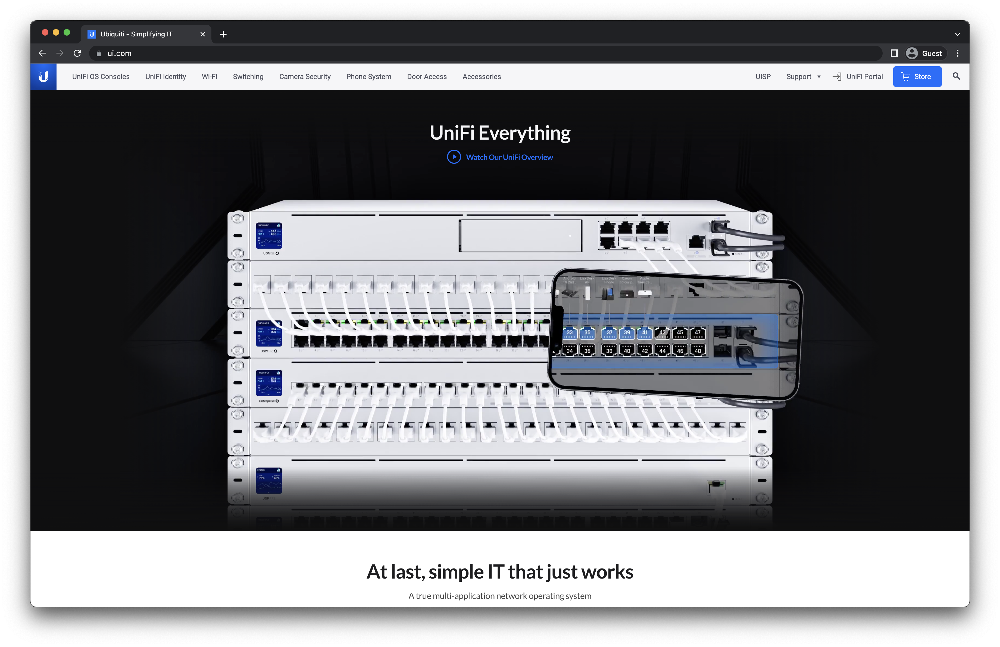
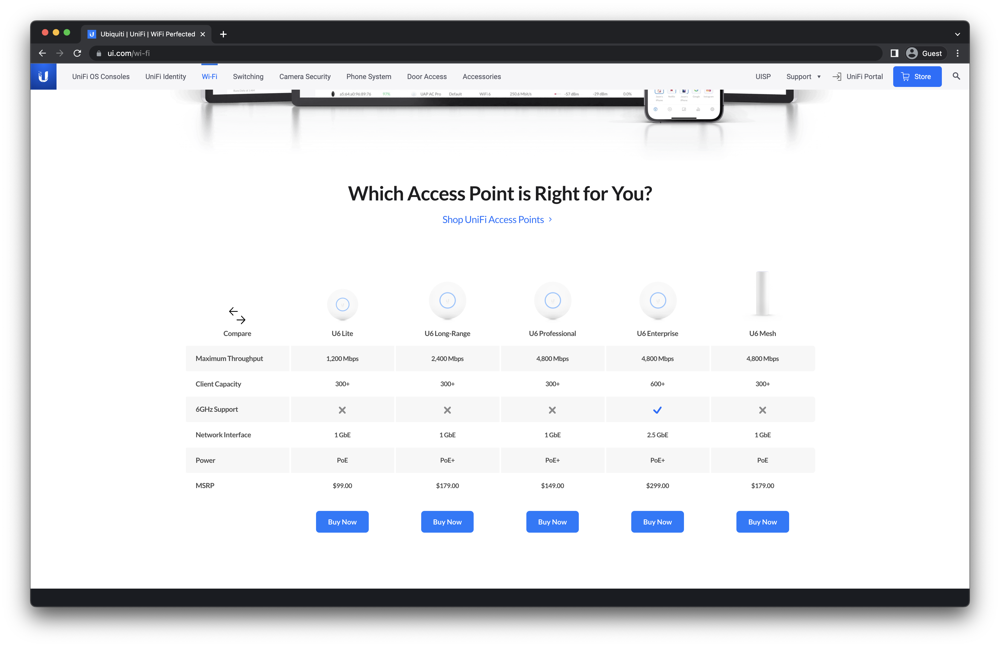

Apple seems to achieve this perfect blend of performance and user experience. Take the M series MacBook Pros. Their performance is unmatched clocking speeds well over desktop stats. Their user experience is flawless inside and out with everything from the solid aluminum chassis to seamless messaging across devices. Ubiquiti has achieved that same balance when it comes to high performant networking equipment with a flawless user experience.

Ubiquiti has products that range from your average home consumer up to small and medium-sized businesses. Their hardware is pretty performant and can handle all sorts of configurations. The user experience is so great that you can get started in minutes and don’t need any advanced understanding to set it up.

## Where to start

To start building out the ultimate setup in your home or business, you will need to get an UniFi OS Console. Think of this as the brains of the operation. It typically acts as the gateway for your network traffic and runs all of the applications such as the networking, security system, phone system, access control, and more.

If you are in a home, start with the [Dream Router](https://store.ui.com/collections/unifi-network-unifi-os-consoles/products/dream-router). It works right out of the box acting as a gateway, router, and access point all in one package. It’s got 4 ports on the back where 2 of which are PoE that allows you to quickly expand your deployment.

If you’re in a business, the [Dream Machine Pro SE](https://store.ui.com/collections/unifi-network-unifi-os-consoles/products/dream-machine-se) is an amazing solution. It works well for smaller deployments while having the ability to expand it out as your business grows. The 8 PoE ports allow you to add access points to cover a large area. You can easily add switches as needed to increase your access point count. [Access points](https://www.ui.com/wi-fi), also just referred to as APs, are atenas that send the WiFi signal that allow devices to connect wirelessly. Having more APs allows you to connect to more devices in more locations.

Another interesting solution that Ubiquiti has just released is the [Dream Wall](https://store.ui.com/collections/unifi-network-unifi-os-consoles/products/dream-wall-ea) which is still in Early Access. It is interesting because it has 16 ports, many of them with PoE, which allows you to deploy many APs instantly. It also has an AP built-in as well as 128GB of storage which allows you to also deploy a security system. It’s interesting because the idea is that if you are the right size business, this is all you need to get started. No extra switches or NVR solutions.
