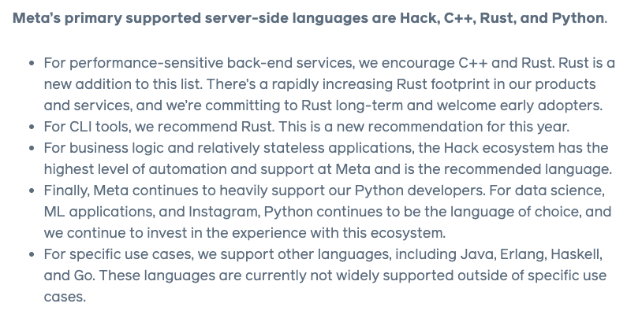

Rust is one of the coolest languages out there and it was just [announced by Meta](https://engineering.fb.com/2022/07/27/developer-tools/programming-languages-endorsed-for-server-side-use-at-meta/) that it is one of their officially supported server-side languages. Meta doesn't support languages on a wim. It's a very thorough process and people should pay attention.

Meta officially supports 4 serverside languages. Hack (basically PHP but better), C++, Rust, and Python. Hack isn't really used for core product use cases so I'm not going to really talk about that. C++ is great but Rust beats it because of the memory safety and it is just as performant. Python is really only used for data engineering and ML applications. I think that Rust is the clear winner for core product use cases.

[ThePrimeagen](https://www.youtube.com/watch?v=oehcVTHRwLE) walked through what this means for Rust and how Meta came to officially support Rust.
