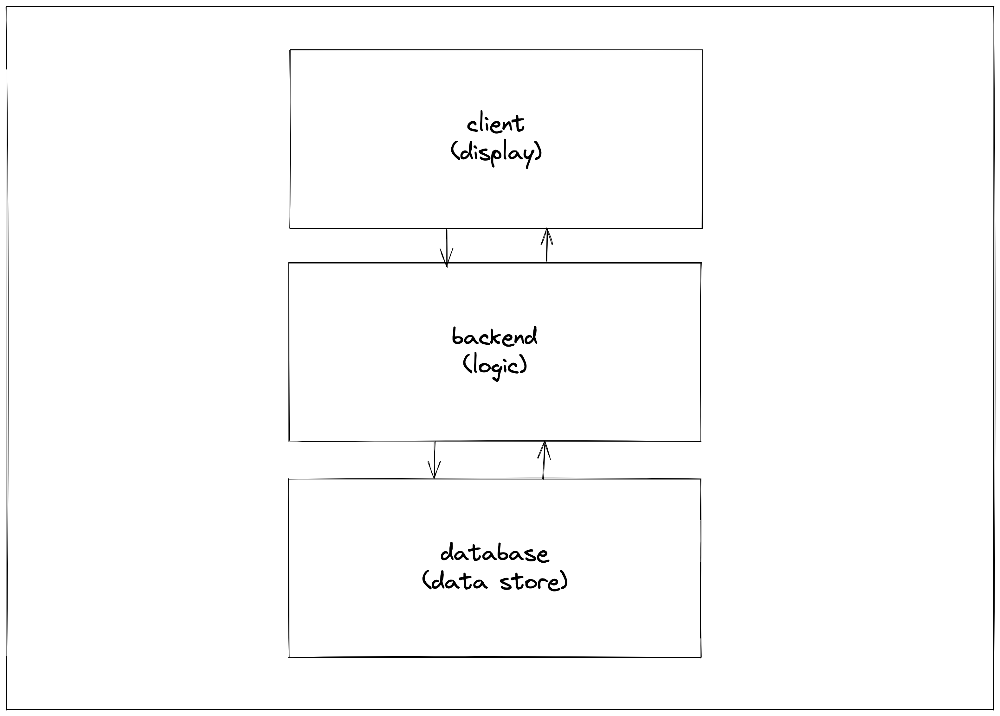
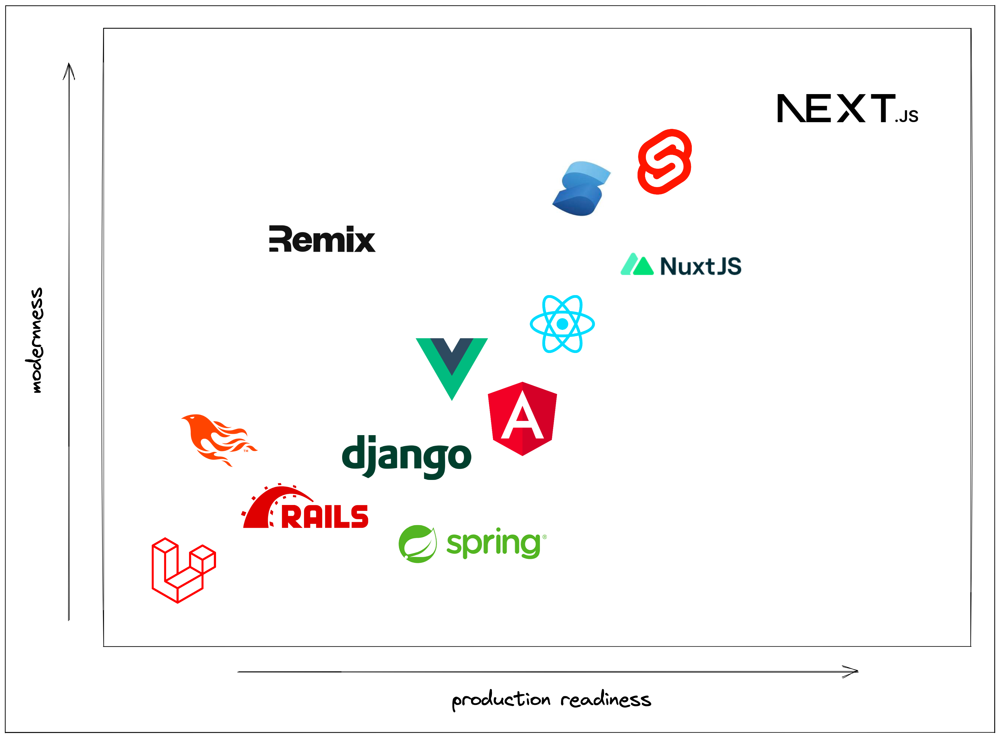
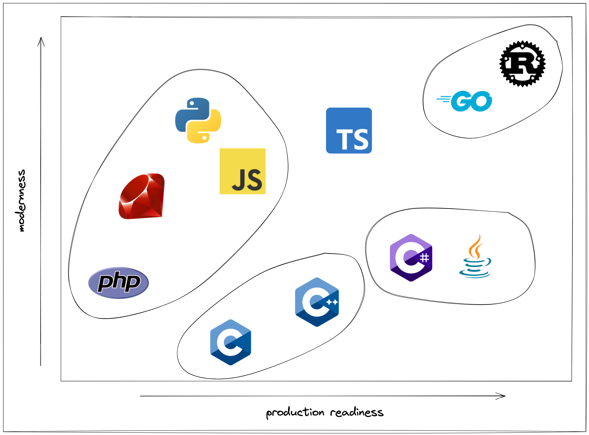
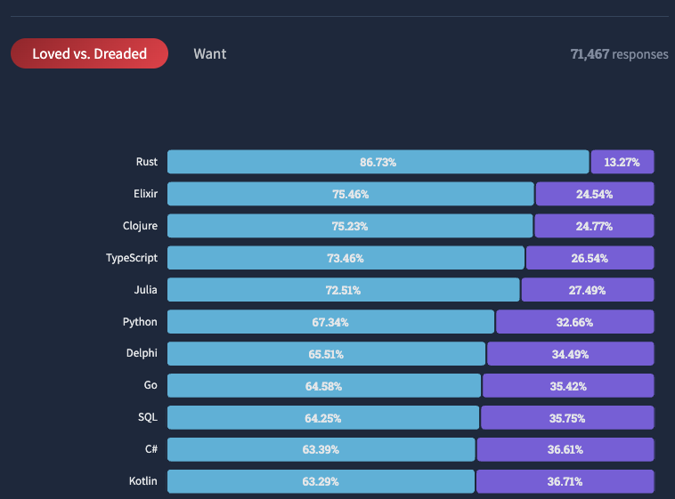
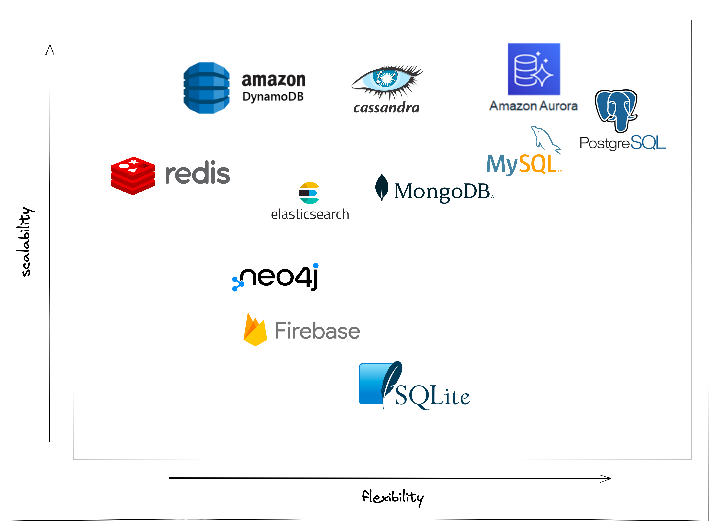
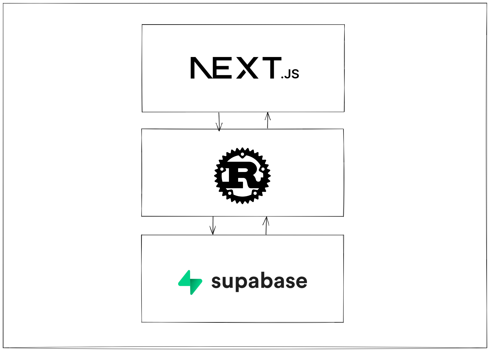

# There's more than one way to skin a cat.

When building an internet application, there is a million ways to do it. The core conponets of a stack boil down to three main parts. A display layer, logic layer, and data store layer.

Most of the worlds code is written for the internet. There's game dev, embedded systems, data science and others but the majority of code primarly revolves around web, mobile, and backend development.

There's a million different ways you can piece together technologies to build a web application. In this article I explain my approach for the stack that I choose to build with. After you read, send me a message with your thoughts.

# Philosophy For Picking A Stack

With that ground level laid, let's dive into the actual stack. This stack is chosen with these two philosophies in mind.

> Maximize developer productivity

> Minimize technical debt

Maximizing developer productivity means building only what is unique about what you are building. If you need auth, a web framework, a backend framework, etc, then just pull in something that's already been built before. There's no need to build that again when the solutions out there are really good and they are open source.

Minimizing technical debt means never building something that engineers are going to have to rewrite sometime down the road. It takes 5x longer to fix technical debt than it is to just do it right in the first place. This includes picking a stack that scales. I've seen so many companies pick a stack "in the name of speed" only to be hammered when they have to rebuild it differently down the road.

Some examples include companies that start with Firebase. Firebase is cute when you are starting because it takes care of a lot of heavy lifting. It becomes a nightmare though when you need switch off of it. Another example is companies that picked Ruby on Rails. It looks good in the beginning with all of the batteries included. It becomes a nightmare at scale when you have more than 5 engineers working on it.

# Choosing The Frontend Framework

# Choosing The Backend Language

I like to group the worlds most popular languages into four buckets for backend development.

> C and C++ - They are the OGs, powerful, old, lots of footguns

> C# and Java - Enterprise heavyweights, powerful, verbose, legacy

> JavaScript, Ruby, Python, PHP - Easy to learn, interpreted, dynamically typed, slow, lots of logic errors

> Rust and Go - Compiled, strongly typed, extremely fast, modern

You may have noticed that TypeScript isn't in a group. TypeScript is in a very interesting place in the current landscape. It's more production ready than its other interpreted counterparts but it still suffers from being quite slow in performance and it's type system isn't good as it should be to be considered amongst the other more production ready langugages.

These groups are sorted on two axes. Modernness and Production Readiness.

#### Production Readiness

This one is pretty straight forward. This looks at things like developer productivity in a team environment, error probablility, scalability, performance, and most importantly minimizing technical debt amongst other things.

#### Modernness

This one may not seem as important or straight forward but it is critical to developer productivity. One example is the package management experience. Compare the C++ package management experience vs Rust's package management experience. It's a night and day difference. There's also a lot of language specific differences that make some langauages much easier to code with than others.

#### Rust

In my opinion, Rust is the clear winner. It's uncomprimising in almost every way and it has an extremely modern feel that has made it the most loved language for the past 7 years. ([2016](https://insights.stackoverflow.com/survey/2016#technology-most-loved-dreaded-and-wanted), [2017](https://insights.stackoverflow.com/survey/2017#most-loved-dreaded-and-wanted), [2018](https://insights.stackoverflow.com/survey/2018#technology-_-most-loved-dreaded-and-wanted-languages), [2019](https://insights.stackoverflow.com/survey/2019#technology-_-most-loved-dreaded-and-wanted-languages), [2020](https://insights.stackoverflow.com/survey/2020#most-loved-dreaded-and-wanted), [2021](https://insights.stackoverflow.com/survey/2021/#technology-most-loved-dreaded-and-wanted) and [2022](https://survey.stackoverflow.co/2022/#section-most-loved-dreaded-and-wanted-programming-scripting-and-markup-languages))

As a side note, you may have noticed that TypeScript is floating in limbo in the diagram above. It's in a very unique position. As I explained above, TypeScript is the go-to language for the frontend with almost no contest. Because TypeScript is inevitable, there could be a use case for TypeScript in the backend. There's also so many ways to deploy TypeScript that it makes it extremely easy to deploy and scale. In fact, Next.js has a way to write backend functions embeded right in the framework. If you want to use TypeScript for the whole stack, I would recommend checking out [Create T3 App](https://create.t3.gg/).

# Choosing The Database

# The Stack

The stack consists of using Next.js with TypeScript on Vercel for the frontend. Axum with rust on Railway for the backend. Postgres on Supbase for the database. The deployment methods are listed but can easily be swapped out due to one of the core tenants of the stack being no vendor lock-in (no vendor lock-in is key to minimizing technical debt).

These three technologies can be used to scale to millions of users (granted the deployment methods will need to be adapted but Next, Rust, and Postgres are well equiped to do that). 

