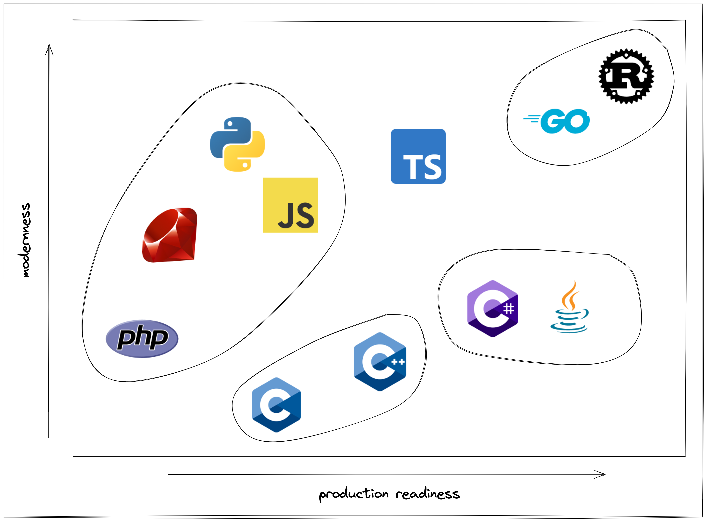
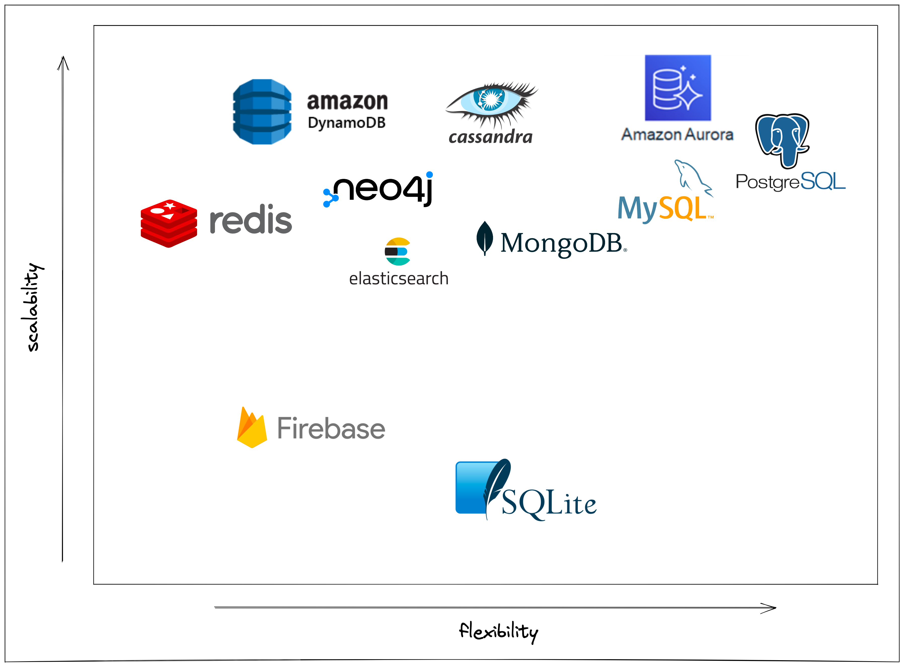

When building an internet application, there is a million ways to do it. With so many decisions to make, what is the best stack to pick? In this article I go through my thought process on how I chose to build with the stack I use.

# Philosophy For Picking A Stack

When I am making these kinds of decisions, I look at it through two main lenses.

> Maximize developer productivity

Maximizing developer productivity means building only what is unique about what you are building. If you need auth, a web framework, a backend framework, etc, then just pull in something that's already been built before. There's no need to build that again when there are some really awesome open source solutions.

In two of my diagrams I use the word `modernness` on the Y axis. "Modernness" has a direct correlation with maximizing developer productivity. 

> Minimize technical debt

Minimizing technical debt means never building something that engineers are going to have to rewrite sometime down the road. It takes 5x longer to fix technical debt than it is to just do it right in the first place. This includes picking a stack that scales. I've seen so many companies pick a stack "in the name of speed" only to be hammered when they have to rebuild it differently down the road.

In two of my diagrams I use the word `production readiness` on the X axis. "Production readiness" has a direct correlation with minimizing technical debt.

<!-- Some examples include companies that start with Firebase. Firebase is cute when you are starting because it takes care of a lot of heavy lifting. It becomes a nightmare though when you need switch off of it. Another example is companies that picked Ruby on Rails. It looks good in the beginning with all of the batteries included. It becomes a nightmare at scale when you have more than 5 engineers working on it. -->

# Components Of A Stack

The core conponets of a stack boil down to three main parts. A display layer, logic layer, and data store layer.

# Choosing The Frontend Framework

If you want a case study in decision paralysis look no further than trying to pick a frontend framework. There are thousands of options to choose from. One quick way that we can narrow the list is by eliminating all non JavaScript/TypeScript frontend frameworks. There's many out there such as Rails, Spring, Laravel, Django, Phoenix, and others but modern JavaScript frameworks blow them out of the water. The non JavaScript frameworks are mainly used as backend frameworks now.

You still have thousands of options to choose from. The big boys are [React](https://reactjs.org/), [Vue](https://vuejs.org/), and [Angular](https://angular.io/). Angular (built by Google) being the OG and React (built by Facebook) being the most popular. Most other frameworks are a spinoff of one of these two.

It still leaves us with the question, which one is best? In my opinion, [Next.js](https://nextjs.org/) (a meta-framework for React) takes the best that React has to offer and solves all of React's biggest problems. It's the most modern and most production ready framework out there.

Some of the most massive websites use Next.js such as TikTok, Hulu, Twitch, Doordash, HBO Max, Target, Walmart, and [so many more](https://nextjs.org/showcase).

# Choosing The Backend Language

I like to group the worlds most popular languages into four buckets for backend development.

> `C and C++` - They are the OGs, powerful, old, lots of footguns

> `C# and Java` - Enterprise heavyweights, powerful, verbose, legacy

> `JavaScript, Ruby, Python, and PHP` - Easy to learn, interpreted, dynamically typed, slow performance, lots of logic errors

> `Rust and Go` - Compiled, strongly typed, extremely fast, modern

<!-- You may have noticed that TypeScript isn't in a group. TypeScript is in a very interesting place in the current landscape. It's more production ready than its other interpreted counterparts but it still suffers from being quite slow in performance and it's type system isn't good as it should be to be considered amongst the other more production ready langugages.

These groups are sorted on two axes. Modernness and Production Readiness.

#### Production Readiness

This one is pretty straight forward. This looks at things like developer productivity in a team environment, error probablility, scalability, performance, and most importantly minimizing technical debt amongst other things.

#### Modernness

This one may not seem as important or straight forward but it is critical to developer productivity. One example is the package management experience. Compare the C++ package management experience vs Rust's package management experience. It's a night and day difference. There's also a lot of language specific differences that make some langauages much easier to code with than others. -->

#### Rust

In my opinion, Rust is the clear winner. It's uncomprimising in almost every way and it has an extremely modern feel that has made it the most loved language for the past 7 years ([2016](https://insights.stackoverflow.com/survey/2016#technology-most-loved-dreaded-and-wanted), [2017](https://insights.stackoverflow.com/survey/2017#most-loved-dreaded-and-wanted), [2018](https://insights.stackoverflow.com/survey/2018#technology-_-most-loved-dreaded-and-wanted-languages), [2019](https://insights.stackoverflow.com/survey/2019#technology-_-most-loved-dreaded-and-wanted-languages), [2020](https://insights.stackoverflow.com/survey/2020#most-loved-dreaded-and-wanted), [2021](https://insights.stackoverflow.com/survey/2021/#technology-most-loved-dreaded-and-wanted) and [2022](https://survey.stackoverflow.co/2022/#section-most-loved-dreaded-and-wanted-programming-scripting-and-markup-languages)).

Rust is also one of the most performant languages on the market

#### TypeScript

As a side note, you may have noticed that TypeScript is floating in limbo in the diagram above. It's in a very unique position. As I explained above, TypeScript is the go-to language for the frontend with almost no contest. Because TypeScript is inevitable, there could be a use case for TypeScript in the backend. There's also so many ways to deploy TypeScript that it makes it extremely easy to deploy and scale. In fact, Next.js has a way to write backend functions embeded right in the framework. If you want to use TypeScript for the whole stack, I would recommend checking out [Create T3 App](https://create.t3.gg/).

# Choosing The Database

The database technology that you choose is probably the most important aspect of your stack. It's fun to choose bleeding edge technologies for the frontend and backend, but you should pick the most reliable option for your database technology.

There are a lot of databases that have a specific use case such as redis or elasticsearch but for this we are going to focus on picking a core database technology.

Postgres is going to be the best option for many reasons. It is the most flexible giving you the ability to store any kind of data that you would like to. It's open source which means that you can port it wherever you would like. It's quite scalable with the option to move it to something like Aurora down the road.

Avoid technologies such as Firebase as there is an extreme amount of technical debt that is incurred in the long term compared to the marginal ammount of increased developer speed in the short term. It also becomes extremely expensive at scale due to the high cost of the hosted technology and the cost of development to migrate off of Firebase.

Along with Rust, Postgres ranks high as one of the most loved database technologies for 6 years in a row.

# The Stack

The stack consists of using [Next.js](https://nextjs.org/) with [TypeScript](https://www.typescriptlang.org/) on [Vercel](https://vercel.com/) for the frontend. [Axum](https://github.com/tokio-rs/axum) with [Rust](https://www.rust-lang.org/) on [Railway](https://railway.app/) for the backend. [Postgres](https://www.postgresql.org/) on [Supbase](https://supabase.com/) for the database. The deployment methods are listed but can easily be swapped out due to one of the core tenants of the stack being no vendor lock-in (no vendor lock-in is key to minimizing technical debt).

These three technologies can be used to scale to millions of users (granted the deployment methods will need to be adapted but Next, Rust, and Postgres are well equiped to do that). 

